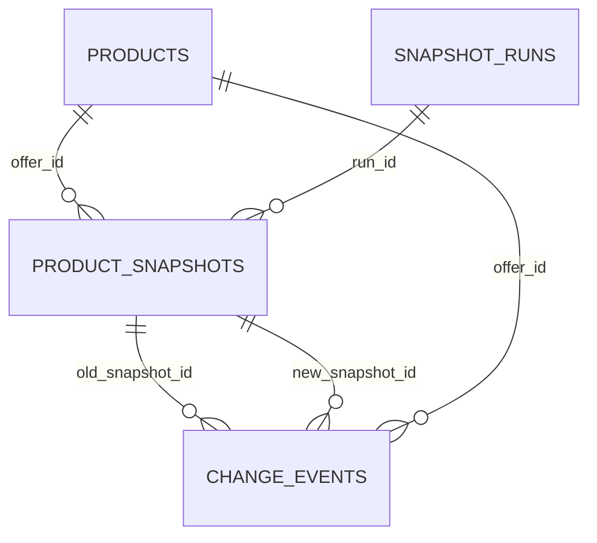

# PostgreSQL DDL Design: Snapshot Layer v1

## Статус документа

Этот документ — проект будущей PostgreSQL-структуры Snapshot Layer v1. Он уточняет [Snapshot Layer v1](SNAPSHOT_LAYER_V1.md), но не является SQL-миграцией и не содержит команд для выполнения.

В v1 создаются только логические сущности:

- `snapshot_runs`;
- `product_snapshots`;
- `change_events`.

Единственный допустимый тип события v1: `PRICE_CHANGED`.

## Общая модель связей

`products` — существующий справочник и владелец канонического `offer_id`. Три новые сущности не заменяют и не изменяют исходные таблицы Phase A.

## 1. `snapshot_runs`

### Назначение

Одна строка описывает одну попытку Snapshot Collector сформировать набор снимков после завершения OZON Phase A. Таблица отделяет полный валидный запуск от неполного или ошибочного и служит корнем аудита всех созданных снимков.

### Поля

| Поле | PostgreSQL тип | Null | Назначение |
|---|---|---:|---|
| `run_id` | `uuid` | Нет | Первичный идентификатор запуска. |
| `idempotency_key` | `text` | Нет | Детерминированный ключ запуска для защиты от повторного вызова n8n с тем же набором исходных данных. |
| `run_type` | `text` | Нет | В v1 допустимо только значение `daily`. |
| `business_date` | `date` | Нет | Операционная дата в `Europe/Moscow`. |
| `started_at` | `timestamptz` | Нет | Время старта в UTC. |
| `completed_at` | `timestamptz` | Да | Время завершения в UTC. |
| `status` | `text` | Нет | `running`, `success`, `partial` или `failed`. |
| `source_watermark` | `timestamptz` | Да | Последняя исходная ценовая точка, которая вошла в запуск. |
| `products_expected` | `integer` | Да | Число товаров, ожидаемых от источника. |
| `products_snapshotted` | `integer` | Нет | Число товаров с созданным снимком. |
| `products_invalid` | `integer` | Нет | Число товаров с неполными/некорректными данными. |
| `trigger_reference` | `text` | Да | Идентификатор выполнения n8n для трассировки. |
| `error_summary` | `text` | Да | Краткое безопасное описание ошибки. |
| `created_at` | `timestamptz` | Нет | Техническое время создания записи в UTC. |

### Ключи, индексы и ограничения

- **PRIMARY KEY:** `run_id`.
- **UNIQUE:** `idempotency_key`.
- **Индекс:** `(business_date DESC, status)` — поиск последних запусков и незавершённых/ошибочных запусков.
- **Индекс:** `(trigger_reference)` — трассировка от выполнения n8n, если значение не `NULL`.
- **CHECK:** `run_type = 'daily'` в v1.
- **CHECK:** `status` входит в утверждённый набор статусов.
- **CHECK:** все счётчики неотрицательны.
- **CHECK:** `completed_at` не раньше `started_at`, когда `completed_at` задан.
- **CHECK:** для статуса `success` значение `completed_at` обязательно.

## 2. `product_snapshots`

### Назначение

Одна строка хранит неизменяемое состояние одного товара в рамках одного Snapshot Run. В v1 основная метрика — `current_price`; остатки и текущая себестоимость сохраняются только как контекст для последующих версий.

### Поля

| Поле | PostgreSQL тип | Null | Назначение |
|---|---|---:|---|
| `snapshot_id` | `uuid` | Нет | Первичный идентификатор снимка. |
| `run_id` | `uuid` | Нет | Ссылка на запуск, создавший снимок. |
| `offer_id` | `text` | Нет | Канонический товар из `products.offer_id`. |
| `snapshot_at` | `timestamptz` | Нет | Момент фиксации состояния в UTC. |
| `business_date` | `date` | Нет | Операционная дата снимка в `Europe/Moscow`. |
| `current_price` | `numeric(14,2)` | Да | Последнее валидное значение `ozon_price_history.price`. |
| `price_updated_from_ozon` | `timestamptz` | Да | Время исходной ценовой точки Ozon. |
| `cost_price_used` | `numeric(14,2)` | Да | Текущая единичная себестоимость из `products.cost_price`; контекст, не источник PRICE_CHANGED. |
| `fbo_stock` | `integer` | Да | Остаток FBO из `stock_history`. |
| `fbs_stock` | `integer` | Да | Остаток FBS из `stock_history`. |
| `rfbs_stock` | `integer` | Да | Остаток rFBS из `stock_history`. |
| `reserved_stock` | `integer` | Да | Суммарный резерв по доступным типам склада. |
| `source_name` | `text` | Нет | В v1: `ozon_phase_a`. |
| `data_quality_status` | `text` | Нет | `valid`, `partial` или `invalid`. |
| `created_at` | `timestamptz` | Нет | Техническое время записи в UTC. |

### Ключи и связи

- **PRIMARY KEY:** `snapshot_id`.
- **FOREIGN KEY:** `run_id` → `snapshot_runs.run_id`, с запретом удаления запуска, если у него есть снимки.
- **FOREIGN KEY:** `offer_id` → `products.offer_id`, с запретом удаления товара, если существует история снимков.
- **UNIQUE:** `(run_id, offer_id)`. Один запуск не может сформировать два снимка одного товара.

### Индексы

- `(offer_id, snapshot_at DESC)` — основной доступ к предыдущему валидному снимку при поиске изменения цены.
- `(business_date, data_quality_status)` — контроль полноты и выборка валидных daily-снимков.
- Отдельный индекс на `run_id` не требуется: его покрывает уникальное ограничение `(run_id, offer_id)`.

### Ограничения

- `data_quality_status` ограничен значениями `valid`, `partial`, `invalid`.
- Остатки, если переданы, неотрицательны.
- `current_price`, если передана, неотрицательна.
- Для `data_quality_status = 'valid'` в v1 обязательны `current_price` и `price_updated_from_ozon`.
- `source_name` в v1 ограничен значением `ozon_phase_a`.

## 3. `change_events`

### Назначение

Таблица хранит неизменяемый факт обнаруженного изменения между двумя снимками. В v1 она хранит только `PRICE_CHANGED`; событие не выполняет никаких действий над товаром или Ozon.

### Поля

| Поле | PostgreSQL тип | Null | Назначение |
|---|---|---:|---|
| `event_id` | `uuid` | Нет | Первичный идентификатор события. |
| `event_type` | `text` | Нет | В v1 только `PRICE_CHANGED`. |
| `offer_id` | `text` | Нет | Канонический товар. |
| `detected_at` | `timestamptz` | Нет | Время обнаружения в UTC. |
| `business_date` | `date` | Нет | Операционная дата события в `Europe/Moscow`. |
| `old_snapshot_id` | `uuid` | Нет | Предыдущий валидный снимок. |
| `new_snapshot_id` | `uuid` | Нет | Новый валидный снимок. |
| `metric` | `text` | Нет | В v1 только `current_price`. |
| `old_value` | `numeric(14,2)` | Нет | Цена из предыдущего снимка. |
| `new_value` | `numeric(14,2)` | Нет | Цена из нового снимка. |
| `absolute_change` | `numeric(14,2)` | Нет | Разность `new_value - old_value`. |
| `change_percent` | `numeric(10,4)` | Да | Процент изменения; `NULL`, если старая цена равна нулю. |
| `severity` | `text` | Нет | `low`, `medium`, `high` или `critical`. |
| `rule_id` | `text` | Нет | Версия правила, например `price_change_v1`. |
| `idempotency_key` | `text` | Нет | Детерминированный ключ конкретного события. |
| `parameters` | `jsonb` | Нет | Пороговые значения, source watermark и дополнительный контекст. |
| `status` | `text` | Нет | `new`, `analyzed`, `acknowledged` или `ignored`. |
| `created_at` | `timestamptz` | Нет | Техническое время создания в UTC. |

### Ключи, связи, индексы и ограничения

- **PRIMARY KEY:** `event_id`.
- **FOREIGN KEY:** `offer_id` → `products.offer_id`.
- **FOREIGN KEY:** `old_snapshot_id` → `product_snapshots.snapshot_id`.
- **FOREIGN KEY:** `new_snapshot_id` → `product_snapshots.snapshot_id`.
- **UNIQUE:** `idempotency_key`.
- **Индекс:** `(offer_id, detected_at DESC)` — история событий товара.
- **Индекс:** `(status, detected_at)` — выборка новых событий AI Analyst или оператором.
- **Индекс:** `(new_snapshot_id)` — трассировка события от нового снимка.
- **CHECK:** `event_type = 'PRICE_CHANGED'` и `metric = 'current_price'` в v1.
- **CHECK:** `old_snapshot_id <> new_snapshot_id`.
- **CHECK:** `severity` и `status` входят в утверждённые наборы значений.
- **CHECK:** `absolute_change = new_value - old_value` должен контролироваться прикладной логикой до вставки; ограничение не должно скрывать ошибку округления.

## Обоснование проектных решений

### Почему `snapshot_id` — UUID

Snapshot Collector, n8n и будущий AI-сервис являются независимыми компонентами. UUID можно генерировать вне базы без риска коллизий и без зависимости от последовательности одного узла. Идентификатор не несёт бизнес-смысла и не раскрывает порядок или количество операций.

### Почему используется `timestamptz`

Аудит показал, что `ozon_price_history.updated_from_ozon` и `stock_history.snapshot_at` уже используют `timestamptz`, а сервер PostgreSQL работает в UTC. `timestamptz` фиксирует абсолютный момент времени и предотвращает неоднозначность при сравнении запуска, источника и события.

`business_date` хранится отдельно как `date`, рассчитанный в `Europe/Moscow`. Она служит операционному календарю и не заменяет точную временную отметку.

### Почему исторические записи immutable

Событие должно быть проверяемым: цена 667 ₽ должна всегда ссылаться на тот снимок и watermark, на основании которых оно обнаружено. Обновление старого снимка задним числом разрушило бы аудит, идемпотентность и объяснимость решения AI.

Поздняя корректировка Ozon создаёт новый Snapshot Run, новый Snapshot и, при выполнении правила, новое событие. Существующие записи не редактируются и не удаляются прикладной логикой.

### Защита от повторного запуска n8n

1. `snapshot_runs.idempotency_key` уникален для одного логического набора исходных данных: типа запуска, business date и source watermark.
2. `product_snapshots (run_id, offer_id)` уникален: повторная обработка одного запуска не дублирует снимок товара.
3. Запуск со статусом `success` нельзя повторно считать новым источником данных без нового source watermark.

### Защита от дублей `PRICE_CHANGED`

`change_events.idempotency_key` строится детерминированно из:

- `event_type`;
- `offer_id`;
- `metric`;
- `old_snapshot_id`;
- `new_snapshot_id`;
- `rule_id`.

Уникальность этого ключа гарантирует одно событие для одной пары снимков и одной версии правила. Повторный запуск Change Detection только находит уже существующее событие, а не создаёт второе.

## Поля, намеренно не создаваемые в v1

Следующие данные и сущности не входят в DDL v1:

- `revenue`, `profit`, `profit_per_unit`, `delivered_units`;
- `commission`, `commission_rate`, `logistics`, `logistics_per_unit`, `payout`;
- `return_count`, `returned_units`, причины и статусы возврата;
- финансовые event types: `PROFIT_CHANGED`, `SALES_CHANGED`, `COMMISSION_CHANGED`, `LOGISTICS_CHANGED`;
- региональные показатели;
- таблицы AI-решений, уведомлений и автоматических действий;
- отдельная таблица правил: в v1 версия правила фиксируется полем `rule_id` и контекстом `parameters`.

## Переход от MVP v1 к финансовым событиям

В аудите выявлено, что `products.cost_price` для `УФ 005Б` равен 166 ₽, а агрегированный `vw_product_analytics.cost_price` равен 332 ₽. Это показывает, что финансовые данные и единичная себестоимость сейчас имеют разное зерно.

Также `sales` и финансовые view содержат разные временные диапазоны и разные количества доставленных единиц. До определения единого дневного источника `delivered_units` расчёт `profit_per_unit` может быть некорректным.

Поэтому в v1 намеренно не включаются:

- `PROFIT_CHANGED` — нужна согласованная формула прибыли и версия единичной себестоимости на дату операции;
- `SALES_CHANGED` — нужен периодизированный и подтверждённый источник delivered units/orders;
- `COMMISSION_CHANGED` — нужно различать текущую ставку и фактическую комиссию финансовой операции.

Переход возможен после отдельного проектирования дневного финансового снимка: утверждения зерна, часовой семантики `timestamp without time zone`, источника единиц и правил поздних корректировок Ozon.

## Согласованность с Snapshot Layer v1

Этот DDL-дизайн сохраняет все ограничения базовой архитектуры:

- использует `products.offer_id` как канонический идентификатор;
- использует `ozon_price_history` как авторитетную историю цены;
- использует `stock_history` только как контекст без stock-событий;
- оставляет единственным событием v1 `PRICE_CHANGED`;
- хранит UTC timestamps и `business_date` в `Europe/Moscow`;
- не предусматривает автоматических изменений товара, Ozon, PostgreSQL-источников или n8n workflow.
