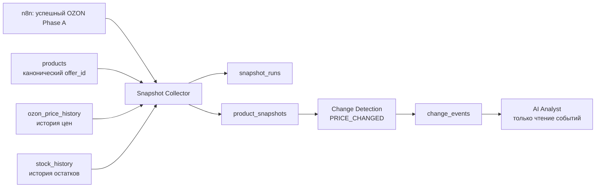

# Snapshot Layer v1

## Статус и границы MVP

Этот документ описывает целевую архитектуру Snapshot Layer v1 для EFA OS на основе read-only аудита PostgreSQL от 2026-08-14.

Документ не является миграцией, кодом или инструкцией на изменение существующих таблиц. В MVP v1 создаётся только основа для фиксации цены и события `PRICE_CHANGED`.

В v1 не входят:

- финансовые события;
- автоматические действия AI;
- изменение товаров, цен, остатков или данных Ozon;
- изменение существующих n8n workflow.

## 1. Цель Snapshot Layer

Snapshot Layer хранит неизменяемые состояния товара на момент времени. Это позволяет надёжно сравнивать цену товара сегодня с предыдущим валидным состоянием и формировать фактическое событие изменения цены.

Первая задача слоя: определить изменение `current_price` для канонического `products.offer_id` и записать событие `PRICE_CHANGED` для дальнейшего анализа человеком или AI Analyst.

## 2. Место в архитектуре EFA OS



n8n остаётся оркестратором существующей загрузки Ozon. Snapshot Layer запускается только после успешного завершения этой загрузки. Он читает существующие источники и в будущем записывает собственные снимки и события, не изменяя исходные аналитические данные.

## 3. Подтверждённые источники данных

### `products`

Назначение: основной справочник товаров.

Подтверждённые поля:

- `offer_id text` — первичный ключ и канонический идентификатор товара;
- `name text` — название товара;
- `cost_price numeric` — текущая единичная себестоимость;
- `price`, `min_price` — текущие ценовые поля;
- `stock_fbo`, `stock_fbs`, `reserved_fbs` — текущие агрегированные остатки.

Для v1 `products.offer_id` используется как единственный идентификатор. Таблица не является авторитетным источником исторической цены: её поля могут отражать состояние позднее или раньше фактической ценовой точки.

### `ozon_price_history`

Назначение: авторитетная история изменения цены.

Подтверждённые поля:

- `offer_id text`;
- `price numeric`;
- `old_price numeric`;
- `min_price numeric`;
- `marketing_price numeric`;
- `updated_from_ozon timestamptz`;
- `created_at timestamptz`.

Для `current_price` в v1 используется последняя запись по `updated_from_ozon` для каждого `offer_id`.

### `stock_history`

Назначение: история складских снимков.

Подтверждённые поля:

- `snapshot_at timestamptz`;
- `offer_id text`;
- `type text` (`fbo`, `fbs`, `rfbs`);
- `present integer`;
- `reserved integer`.

`stock_history` включён в контракт Snapshot Layer как готовый источник будущих снимков. В v1 данные остатков могут сохраняться как контекст, но не создают события.

## 4. MVP v1

### Единственное событие

`PRICE_CHANGED` — изменение значения `ozon_price_history.price` между двумя последовательными валидными снимками одного товара.

### Алгоритм

1. После успешного Phase A создаётся запись запуска со статусом `running`.
2. Для каждого товара берётся последняя валидная цена из `ozon_price_history`.
3. Создаётся неизменяемый снимок с этой ценой.
4. Новый снимок сравнивается с предыдущим валидным снимком того же `offer_id`.
5. Если цена изменилась и правило порога выполнено, создаётся одно идемпотентное событие `PRICE_CHANGED`.
6. Запуск завершается статусом `success`, `partial` или `failed`.

Снимок без предыдущей валидной цены является базовым и не создаёт событие.

### Начальное правило события

Событие создаётся, когда одновременно выполняются условия:

- абсолютное изменение цены не менее 20 ₽;
- относительное изменение цены не менее 5%.

Если старая цена равна нулю или отсутствует, процент изменения не рассчитывается. Такое состояние не должно автоматически становиться ценовым событием без отдельного правила качества данных.

## 5. Будущие таблицы

Ниже приведены структура и назначение будущих таблиц. Их создание не входит в этот документ.

### `snapshot_runs`

Одна строка на запуск Snapshot Collector. Таблица нужна для контроля полноты, идемпотентности и причин ошибок.

| Поле | Будущий тип | Назначение |
|---|---|---|
| `run_id` | UUID | Идентификатор запуска. |
| `run_type` | text | Тип запуска: в v1 `daily`. |
| `business_date` | date | Операционная дата в `Europe/Moscow`. |
| `started_at` | timestamptz | Начало запуска в UTC. |
| `completed_at` | timestamptz | Окончание запуска в UTC. |
| `status` | text | `running`, `success`, `partial` или `failed`. |
| `source_watermark` | timestamptz | Самое позднее время исходных данных, вошедших в запуск. |
| `products_expected` | integer | Ожидаемое число товаров. |
| `products_snapshotted` | integer | Число успешно созданных снимков. |
| `products_invalid` | integer | Число товаров с неполными или ошибочными данными. |
| `trigger_reference` | text | Идентификатор выполнения n8n. |
| `error_summary` | text | Краткая причина ошибки без секретов. |

### `product_snapshots`

Одна строка на товар в одном успешном запуске. Снимки append-only: они не обновляются после записи.

| Поле | Будущий тип | Назначение |
|---|---|---|
| `snapshot_id` | UUID | Идентификатор снимка. |
| `run_id` | UUID | Ссылка на `snapshot_runs`. |
| `offer_id` | text | Канонический идентификатор из `products.offer_id`. |
| `snapshot_at` | timestamptz | Момент фиксации снимка в UTC. |
| `business_date` | date | Дата снимка в `Europe/Moscow`. |
| `current_price` | numeric | Последняя цена из `ozon_price_history.price`. |
| `price_updated_from_ozon` | timestamptz | Время исходной ценовой точки Ozon. |
| `cost_price_used` | numeric | Текущая единичная себестоимость из `products.cost_price`; контекст, не источник события v1. |
| `fbo_stock` | integer | Остаток FBO из `stock_history`, если доступен на момент снимка. |
| `fbs_stock` | integer | Остаток FBS из `stock_history`, если доступен на момент снимка. |
| `rfbs_stock` | integer | Остаток rFBS из `stock_history`, если доступен на момент снимка. |
| `reserved_stock` | integer | Сумма доступных резервов по типам склада. |
| `source_name` | text | В v1: `ozon_phase_a`. |
| `data_quality_status` | text | `valid`, `partial` или `invalid`. |
| `created_at` | timestamptz | Техническое время записи в UTC. |

Финансовые поля (`revenue`, `profit`, `profit_per_unit`, `delivered_units`) сознательно не включены в события v1. Их добавление требует отдельного согласования временного зерна финансов и единичной себестоимости.

### `change_events`

Одна строка на подтверждённое изменение одной метрики между двумя снимками. В v1 допустим только `PRICE_CHANGED`.

| Поле | Будущий тип | Назначение |
|---|---|---|
| `event_id` | UUID | Идентификатор события. |
| `event_type` | text | В v1 только `PRICE_CHANGED`. |
| `offer_id` | text | Канонический товар. |
| `detected_at` | timestamptz | Время обнаружения в UTC. |
| `business_date` | date | Операционная дата события. |
| `old_snapshot_id` | UUID | Предыдущий валидный снимок. |
| `new_snapshot_id` | UUID | Новый валидный снимок. |
| `metric` | text | В v1: `current_price`. |
| `old_value` | numeric | Предыдущее значение цены. |
| `new_value` | numeric | Новое значение цены. |
| `absolute_change` | numeric | `new_value - old_value`. |
| `change_percent` | numeric | Процентное изменение; `NULL`, если старое значение равно нулю. |
| `severity` | text | `low`, `medium`, `high` или `critical`. |
| `rule_id` | text | Версия применённого правила, например `price_change_v1`. |
| `idempotency_key` | text | Уникальный ключ пары снимков, метрики и правила. |
| `parameters` | JSONB | Пороги, исходный watermark и дополнительный контекст. |
| `status` | text | `new`, `analyzed`, `acknowledged` или `ignored`. |
| `created_at` | timestamptz | Техническое время записи в UTC. |

## 6. Обязательные правила

1. **Immutable snapshots.** После записи `product_snapshots` не изменяются и не пересчитываются задним числом. Поздняя коррекция Ozon создаёт новый запуск и новый снимок.
2. **UTC timestamps.** Все технические временные точки Snapshot Layer хранятся как `timestamptz` в UTC.
3. **Business date.** `business_date` определяется в `Europe/Moscow`, независимо от timezone PostgreSQL (`Etc/UTC`).
4. **Idempotency.** Повторный запуск n8n с теми же исходными данными не создаёт второй снимок или дубликат события.
5. **Только чтение существующих источников.** Snapshot Layer не обновляет `products`, `ozon_price_history`, `stock_history` или другие таблицы Phase A.
6. **Нет автоматических действий.** Событие только фиксирует факт. Оно не меняет цену, остаток, карточку товара или настройку Ozon.
7. **Проверка качества.** Снимок с отсутствующей ценой или неполным источником получает статус `partial`/`invalid` и не участвует в сравнении.

## 7. Тестовый сценарий

Товар: `УФ 005Б`.

Факты read-only аудита:

- первая наблюдаемая цена: 901 ₽;
- последняя наблюдаемая цена: 667 ₽;
- изменение: -234 ₽;
- процент изменения: -25.97%;
- источник: `ozon_price_history`;
- ценовых точек в истории: 15.

Ожидаемый результат после появления двух валидных снимков:

```text
event_type: PRICE_CHANGED
offer_id: УФ 005Б
metric: current_price
old_value: 901.00
new_value: 667.00
absolute_change: -234.00
change_percent: -25.97
severity: high
```

Изменение проходит начальный порог 20 ₽ и 5%, поэтому должно создать одно событие `PRICE_CHANGED`.

## 8. Ограничения и риски v1

- `prices` и `ozon_prices` для `УФ 005Б` содержали устаревшее значение 901 ₽, поэтому не должны использоваться как основной источник текущей цены.
- В `ozon_price_history` сейчас нет специализированного индекса по `(offer_id, updated_from_ozon)`; он понадобится до масштабирования на тысячи товаров.
- PostgreSQL использует UTC, но часть старых финансовых источников хранит `timestamp without time zone`. В v1 ценовые временные точки берутся только из `timestamptz`-полей.
- История `ozon_price_history` на момент аудита охватывала 2026-08-06—2026-08-13. До появления предыдущей валидной точки событие не создаётся.
- AI Analyst в v1 только читает `change_events`; автоматические решения и действия запрещены.
