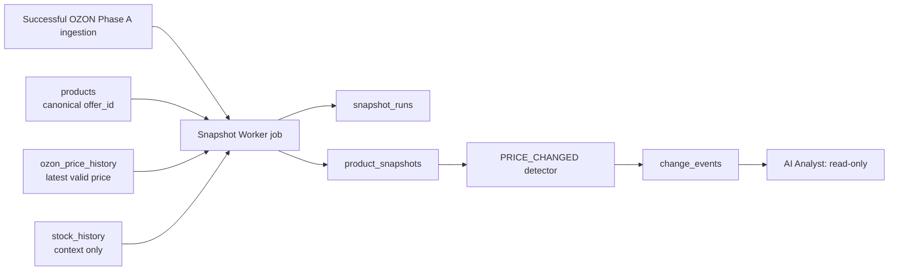

# Snapshot Worker v1 — технический дизайн

## Статус и границы

Этот документ описывает будущий Snapshot Worker для Snapshot Layer v1. Он не создаёт Docker service, код, переменные окружения, PostgreSQL-объекты или изменения n8n workflow.

Worker реализуется только после явного применения и проверки миграции `database/migrations/001_snapshot_layer_v1.sql`.

Границы v1:

- единственный тип события — `PRICE_CHANGED`;
- канонический идентификатор товара — `products.offer_id`;
- источником цены служит `ozon_price_history`;
- снимки и события — неизменяемые исторические факты;
- worker не меняет товары, цены, остатки, promotions или настройки Ozon;
- AI получает события только для чтения и интерпретации, без автоматических действий.

Связанные документы:

- [Snapshot Layer v1](SNAPSHOT_LAYER_V1.md);
- [DDL Design: Snapshot Layer v1](SNAPSHOT_LAYER_DDL_DESIGN_V1.md);
- [Database migration instructions](../../database/README.md).

## 1. Назначение worker

Snapshot Worker — детерминированный фоновый job, который запускается после успешного получения данных OZON Phase A. Его задача — преобразовать уже загруженные факты PostgreSQL в проверяемое состояние товара на момент времени и, при необходимости, в событие изменения цены.

Worker отвечает за следующий конвейер:



Worker не загружает данные из OZON API, не рассчитывает финансовые события, не заменяет SQL views и не выполняет роль Decision Engine.

## 2. Почему отдельный Docker service

Рекомендуется отдельный Docker service, запускаемый как одноразовый job, а не логика в n8n JavaScript node или долгоживущий AI-agent.

| Причина | Решение |
|---|---|
| Воспроизводимость | Python runtime, зависимости и версия worker фиксируются отдельным Docker image. |
| Изоляция | Ошибка worker не изменяет n8n workflow и не смешивает вычисления monitoring с ingestion. |
| Детерминизм | Один входной watermark и один idempotency key дают повторяемый результат без AI-логики. |
| Безопасность | Сервис получает только минимальные PostgreSQL credentials через local environment configuration. |
| Эксплуатация | Job имеет явный exit code, structured logs и может быть повторён после исправления инфраструктурной ошибки. |
| Масштабирование | В будущем worker можно запускать отдельно от n8n и масштабировать по пакетам товаров без изменения workflow. |

В v1 service не должен постоянно слушать очередь или принимать публичный HTTP-трафик. Рекомендуемый режим — одноразовый container command, который позднее может вызываться n8n только после успешного ingestion. До появления такого шага n8n остаётся без изменений.

## 3. Предлагаемая структура каталогов

Ниже показана будущая структура; она не создаётся этим документом.

```text
services/
  snapshot_worker/
    Dockerfile                 Isolated runtime for the worker job
    requirements.txt           Worker-only Python dependencies
    src/
      snapshot_worker/
        __main__.py            Command entry point and exit codes
        config.py              Environment validation and typed settings
        runner.py              Run lifecycle orchestration
        sources.py             Read-only access to products and price history
        snapshots.py           Snapshot construction and persistence contract
        events.py              PRICE_CHANGED comparison and event contract
        repositories.py        Transaction-scoped PostgreSQL access
        logging.py             Structured, secret-safe logging
        models.py              Internal typed records only
    tests/
      unit/                    Pure validation and event-rule tests
      integration/             Disposable PostgreSQL integration tests
```

Root-level `database/` remains the home of reviewed SQL migrations. `services/snapshot_worker/` must not duplicate migration SQL, n8n workflow JSON, or existing analytical views.

## 4. Ответственность компонентов

| Компонент | Ответственность | Не делает |
|---|---|---|
| `config` | Загружает environment variables, проверяет обязательные параметры и режим запуска. | Не читает `.env` из Git и не выводит секреты. |
| `runner` | Управляет стадиями job, транзакциями, статусом run и кодом завершения. | Не содержит бизнес-правила цены. |
| `sources` | Читает `products`, последнюю валидную запись `ozon_price_history` и необязательный stock context. | Не обращается к OZON API и не обновляет исходные таблицы. |
| `snapshots` | Формирует значения `product_snapshots` и статусы качества данных. | Не обновляет уже записанный snapshot. |
| `events` | Сравнивает два валидных снимка одного `offer_id`, применяет пороги v1 и формирует `PRICE_CHANGED`. | Не создаёт финансовые, stock или AI events. |
| `repositories` | Выполняет parameterized SQL и ограничивает запись таблицами Snapshot Layer. | Не меняет Phase A tables/views. |
| `logging` | Пишет структурированные operational logs и итог job. | Не логирует пароли, DSN или секретные headers. |

## 5. Переменные окружения

Значения задаются только локально: через Docker Compose environment, Docker secrets или локальный `.env`, который не попадает в Git. `*.example` файлы содержат только пустые или безопасные шаблонные значения.

### Обязательные

| Переменная | Назначение | Правило валидации |
|---|---|---|
| `EFA_DB_HOST` | PostgreSQL host | Непустая строка. |
| `EFA_DB_PORT` | PostgreSQL port | Целое число от 1 до 65535. |
| `EFA_DB_NAME` | Database name | Непустая строка. |
| `EFA_DB_USER` | Database user | Непустая строка. |
| `EFA_DB_PASSWORD` | Database password | Непустая строка; значение не выводится в logs. |

### Настройки worker

| Переменная | Значение v1 / пример | Назначение |
|---|---|---|
| `EFA_SNAPSHOT_DRY_RUN` | `false` | При `true` запрещает все записи в PostgreSQL. |
| `EFA_SNAPSHOT_RUN_TYPE` | `daily` | Тип запуска; в v1 допускается только `daily`. |
| `EFA_SNAPSHOT_TRIGGER_REFERENCE` | n8n execution ID | Необязательная трассировка вызова. |
| `EFA_SNAPSHOT_BUSINESS_TIMEZONE` | `Europe/Moscow` | Календарная business date; не заменяет UTC timestamps. |
| `EFA_SNAPSHOT_LOG_LEVEL` | `INFO` | Уровень structured logs. |
| `EFA_SNAPSHOT_BATCH_SIZE` | `500` | Размер read/write пакета; положительное целое число. |

Переменные `EFA_SNAPSHOT_*` — контракт будущего worker. Их добавление в `.env.example` и Docker configuration является отдельной реализационной задачей, не частью этого дизайна.

## 6. Режим dry-run

`dry-run` предназначен для безопасной проверки источников, схемы и будущего результата до записи данных.

В dry-run worker:

1. валидирует конфигурацию и подключение к PostgreSQL;
2. проверяет наличие ожидаемых Snapshot Layer tables и обязательных источников;
3. читает `products`, `ozon_price_history` и доступный stock context;
4. рассчитывает в памяти кандидаты `snapshot_runs`, `product_snapshots` и `PRICE_CHANGED`;
5. выводит количество товаров, invalid/partial данных, кандидатов снимков и кандидатов событий;
6. завершает job с ненулевым кодом при инфраструктурной или конфигурационной ошибке.

В dry-run worker никогда не выполняет `INSERT`, `UPDATE`, `DELETE`, DDL или вызов внешнего API. В логах и итоговом отчёте явно указывается `dry_run=true`.

## 7. Жизненный цикл `snapshot_runs`

### Нормальный запуск

1. Worker определяет `business_date` в `Europe/Moscow`, формирует UTC `started_at` и получает `source_watermark` как самую позднюю валидную ценовую точку, вошедшую в обработку.
2. Формируется детерминированный `idempotency_key` из `run_type`, `business_date` и `source_watermark`.
3. В обычном режиме создаётся `snapshot_runs` со статусом `running`. Это единственная запись run, которую worker может менять во время выполнения.
4. После обработки run переводится в `success`, `partial` или `failed`, заполняются счётчики, `completed_at` и безопасный `error_summary` при необходимости.
5. После terminal status запись run не изменяется. Исправление источника требует нового logical run с новым watermark, а не изменения исторических данных.

### Повторный запуск

- Если `idempotency_key` уже относится к завершённому успешному run, worker завершает работу как idempotent no-op и возвращает его `run_id`.
- Если существует `running` run с тем же ключом, worker не создаёт параллельный run и завершает job с понятным operational error. Политику обработки stale run нужно утвердить отдельно; v1 не должен автоматически переписывать его статус.
- Если run завершён `failed` или `partial`, повтор допускается только по явной утверждённой политике ключей и не должен изменять его snapshots/events задним числом.

## 8. Создание `product_snapshots`

Для каждого `products.offer_id` worker получает последнюю валидную цену из `ozon_price_history`, упорядоченную по `updated_from_ozon`. `stock_history` и `products.cost_price` передаются только как контекст; они не создают события в v1.

Worker формирует одну строку на товар в run со следующими принципами:

- `snapshot_at`, `price_updated_from_ozon` и технические timestamps — UTC `timestamptz`;
- `business_date` — отдельная дата в `Europe/Moscow`;
- `(run_id, offer_id)` уникальна;
- валидная цена создаёт `data_quality_status = valid`;
- отсутствующая или некорректная цена фиксируется как `partial` или `invalid` по утверждённому правилу качества и не участвует в event comparison;
- ранее созданные snapshots не обновляются и не удаляются.

Worker обрабатывает товары пакетами, но не должен считать run успешным, пока не записаны итоговые counters и terminal status.

## 9. Создание `PRICE_CHANGED`

Для каждого нового валидного snapshot worker ищет предыдущий валидный snapshot того же `offer_id`. Базовый snapshot без предыдущего валидного состояния не создаёт event.

`PRICE_CHANGED` создаётся только когда одновременно выполняется:

- `new_value - old_value` по модулю не меньше `20 ₽`;
- процентное изменение по модулю не меньше `5%`;
- предыдущая цена не равна нулю;
- обе цены и связанные snapshots валидны.

Событие получает `event_type = PRICE_CHANGED`, `metric = current_price`, old/new snapshot IDs, old/new values, absolute and percentage change, severity, `rule_id = price_change_v1` и parameters с применёнными порогами.

`change_events.idempotency_key` строится детерминированно из event type, `offer_id`, metric, old/new snapshot IDs и `rule_id`. Уникальное ограничение является последней защитой от дублей при retry.

Тестовый сценарий v1: `УФ 005Б`, `901 ₽ -> 667 ₽`, `-234 ₽`, `-25.97%`. Он превышает оба порога и должен дать одно событие `PRICE_CHANGED` с severity согласно утверждённому правилу.

## 10. Транзакции и правила ошибок

### Транзакционная граница

- Создание `running` run фиксируется отдельно, чтобы worker мог сообщить о последующей неудаче.
- Запись batch snapshots и связанных events выполняется в параметризованных транзакциях PostgreSQL.
- При ошибке batch выполняется rollback; worker не оставляет частично записанный batch.
- После rollback worker фиксирует terminal status `failed` отдельной короткой транзакцией, если соединение доступно.
- `partial` допустим только для обработанного run с явно учтёнными товарами `partial`/`invalid`, а не как замена неизвестной инфраструктурной ошибки.

### Классы ошибок

| Класс | Пример | Поведение |
|---|---|---|
| Configuration | Отсутствует `EFA_DB_PASSWORD`, invalid port, invalid timezone. | Не создаёт run, пишет понятную ошибку, exit code non-zero. |
| Infrastructure | PostgreSQL unavailable, timeout, migration/table missing. | Не пишет snapshots/events; при уже созданном run пытается отметить `failed`; exit code non-zero. |
| Source data | Нет цены, невалидная цена, orphaned `offer_id`. | Учитывает товар как `partial`/`invalid`, продолжает run и отражает его в counters. |
| Idempotency | Existing successful run или concurrent `running` run. | Successful run: no-op; concurrent run: controlled error без дублей. |
| Persistence | FK/unique/check violation или transaction failure. | Rollback текущего batch, safe error log, terminal `failed` если возможно. |

Worker никогда не скрывает ошибку успешным exit code и не выводит traceback, DSN, пароль или SQL parameters, содержащие секреты, в пользовательский log.

## 11. Логирование и наблюдаемость

Логи выводятся в stdout/stderr контейнера в структурированном JSON или эквивалентном машинно-читаемом формате. Минимальные поля записи:

- `timestamp_utc`;
- `level`;
- `component`;
- `event`;
- `run_id` (если уже создан);
- `trigger_reference` (если передан);
- `business_date`;
- `dry_run`;
- счётчики обработанных, valid, partial/invalid и created events;
- безопасный error code и краткое message при ошибке.

Обязательные lifecycle events: `worker_started`, `configuration_validated`, `source_watermark_resolved`, `run_created`, `batch_processed`, `event_detected`, `run_completed`, `worker_failed`.

Логи не должны содержать пароли, connection string, токены, credentials, полные сырые строки данных Ozon или персональные данные клиентов. Детальные product identifiers допустимы только для operational diagnosis и должны быть ограничены уровнем логирования.

## 12. Масштабирование после v1

v1 рассчитан на тысячи товаров при одном активном worker job. Следующий рост не должен менять семантику immutable snapshots или idempotency.

1. Использовать keyset pagination и `EFA_SNAPSHOT_BATCH_SIZE`, а не загружать все товары в память.
2. Использовать индексы, заданные в DDL: прежде всего `(offer_id, snapshot_at DESC)` и event/run indexes.
3. Сохранять один writer для одного logical run; параллельную обработку вводить только после явной стратегии partitioning и lock ownership.
4. Добавить metrics: duration, rows read/written, invalid rate, event rate, retry count и source lag.
5. Отделить scheduling от исполнения: n8n, cron или другой scheduler передаёт только trigger context, а worker сохраняет единый контракт.
6. После подтверждения дневного финансового источника расширять worker новыми event rules, не изменяя семантику `PRICE_CHANGED`.
7. AI Decision Engine подключать только как read-only consumer `change_events`; решения и действия должны храниться отдельно от фактов.

## 13. Критерии готовности к реализации

Перед созданием кода требуется отдельное подтверждение следующих условий:

1. Миграция Snapshot Layer применена вручную и проверена в безопасной среде.
2. Утверждены Docker Compose integration, локальный secret delivery и trigger mechanism.
3. Утверждена политика retry для `failed`, `partial` и stale `running` runs.
4. Есть dry-run test против безопасной PostgreSQL среды без записей.
5. Есть integration test для `УФ 005Б` и правила `901 ₽ -> 667 ₽`.
6. Нет разрешения на автоматическое изменение бизнес-данных или настроек Ozon.
